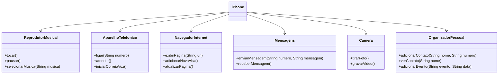
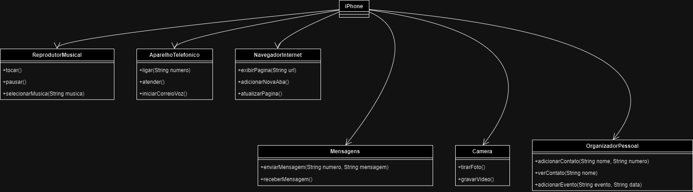

# Projeto iPhone - Modelagem UML e Implementação em Java

Este projeto representa a modelagem UML e a implementação em Java das funcionalidades do iPhone, abrangendo funcionalidades como Reprodutor Musical, Aparelho Telefônico, Navegador na Internet, envio de Mensagens, Câmera e Organizador Pessoal.

## Diagrama UML





## Estrutura de Diretórios

```plaintext
src/
└── com/
    └── iphone/
        ├── camera/
        │   └── Camera.java
        ├── mensagens/
        │   └── Mensagens.java
        ├── navegador/
        │   └── NavegadorInternet.java
        ├── organizador/
        │   └── OrganizadorPessoal.java
        ├── reprodutor/
        │   └── ReprodutorMusical.java
        ├── telefone/
        │   └── AparelhoTelefonico.java
        └── iPhone.java
```

## Compilação e Execução

### Pré-requisitos

- Java Development Kit (JDK) 8 ou superior

### Compilação

Para compilar o projeto, navegue até o diretório `src` e execute o seguinte comando:

```bash
javac com/iphone/**/*.java
```

### Execução

Para executar o projeto, navegue até o diretório `src` e execute o seguinte comando:

```bash
java com.iphone.iPhone
```

## Funcionalidades Implementadas

### Reprodutor Musical

- `tocar()`: Toca a música.
- `pausar()`: Pausa a música.
- `selecionarMusica(String musica)`: Seleciona uma música para tocar.

### Aparelho Telefônico

- `ligar(String numero)`: Liga para um número de telefone.
- `atender()`: Atende uma chamada.
- `iniciarCorreioVoz()`: Inicia o correio de voz.

### Navegador na Internet

- `exibirPagina(String url)`: Exibe uma página da web.
- `adicionarNovaAba()`: Adiciona uma nova aba no navegador.
- `atualizarPagina()`: Atualiza a página atual.

### Mensagens

- `enviarMensagem(String numero, String mensagem)`: Envia uma mensagem de texto.
- `receberMensagem()`: Recebe uma mensagem de texto.

### Câmera

- `tirarFoto()`: Tira uma foto.
- `gravarVideo()`: Grava um vídeo.

### Organizador Pessoal

- `adicionarContato(String nome, String numero)`: Adiciona um contato na agenda.
- `verContato(String nome)`: Visualiza um contato na agenda.
- `adicionarEvento(String evento, String data)`: Adiciona um evento no calendário.

## Autor

Desenvolvido por Samuel Levi Araújo Alves.

## Licença

Este projeto está licenciado sob a Licença MIT. Veja o arquivo `LICENSE` para mais detalhes.
```

Este README fornece uma visão geral do projeto, incluindo a estrutura de diretórios, instruções de compilação e execução, e uma descrição das funcionalidades implementadas. Se precisar de mais alguma coisa, estou à disposição!